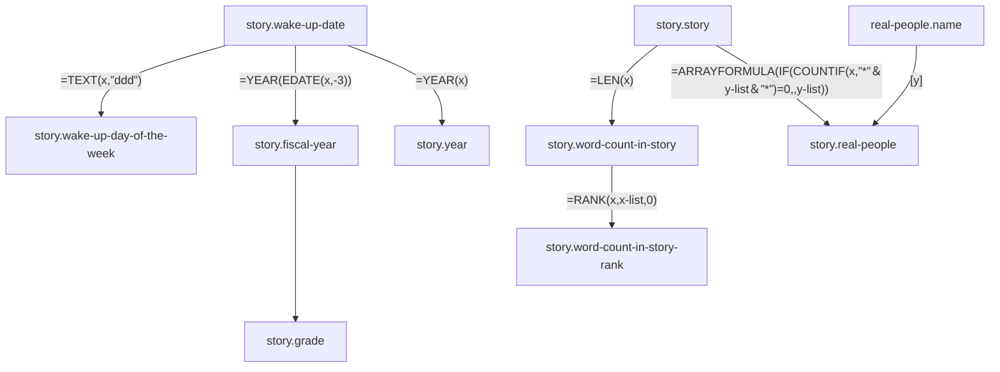
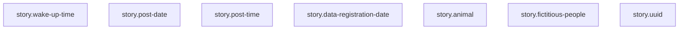
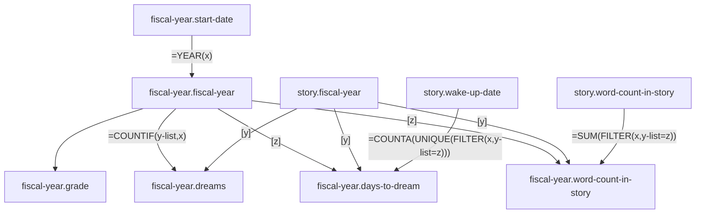
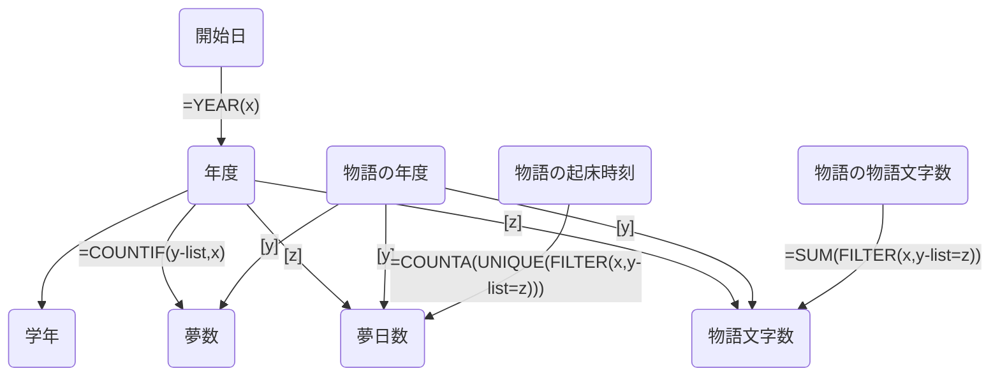
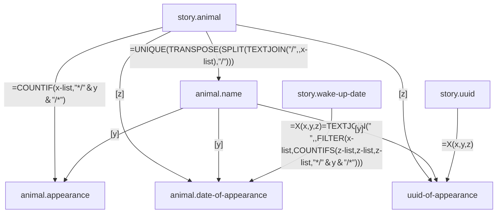

# 💤 Dream Database

### 😆 Profile

|Nationality|Occupation|
|:---|:---|
|Japan|Programmer|

### 📄 Sheet List

|Sheet Name|表名|Tab-separated values|
|:---|:---|:---|
|story|📝物語|story.tsv|
|fiscal-year|📅年度|[fiscal-year.tsv](https://github.com/Asuimin/dream-dataset-harper/blob/main/data/fiscal-year.tsv)|
|famous-people|🤴有名人|[famous-people.tsv](https://github.com/Asuimin/dream-dataset-harper/blob/main/data/famous-people.tsv)|
|animal|🐍生物|[animal.tsv](https://github.com/Asuimin/dream-dataset-harper/blob/main/data/animal.tsv)|
|animal-classification|🐍生物グループ|[animal-classification.tsv](https://github.com/Asuimin/dream-dataset-harper/blob/main/data/animal-classification.tsv)|
|fictitious-people|👺キャラクター|fictitious-people.tsv|
|pokemon|🐣ポケモン|[pokemon.tsv](https://github.com/Asuimin/dream-dataset-harper/blob/main/data/pokemon.tsv)|
|pokemon-region|🐣ポケモングループ|[pokemon-region.tsv](https://github.com/Asuimin/dream-dataset-harper/blob/main/data/pokemon-region.tsv)|
|place|🏕場所|place.tsv|
|sum-total|➕合計|[sum-total.tsv](https://github.com/Asuimin/dream-dataset-harper/blob/main/data/sum-total.tsv)|
|music|🎼音楽|music.tsv|

## 📝 story 物語

## 📅 fiscal-year 年度

## 🐍 animal 生き物

---

## 🤴 Real people appearing in dreams 夢に出てくる実在の人物

### 😄 Elementary school friends known between 6-12 ages. 小学校の友達

|Portrait painting 人物画|Summary 概要|
|:---:|:---|
|Sierra シエラ||
|Olivia オリビア||
|Melissa メリッサ||

### 😄 School friends known between 12-18 ages. 中高の友達

|Portrait painting 人物画|Summary 概要|
|:---:|:---|
| Alexander アレキサンダー  Buddy 親友|He has the strongest number of appearances among his friends. Until FY2020, he and Sam were rivals in the number of appearances, but in FY2021, he won by an overwhelming margin. Among his friends, he has the highest number of appearances in FY 2016, FY 2017 (tied for first place), FY 2018, FY 2020 (tied for first place), and FY 2021. 　友達の中でも最強を誇る登場数。今後、彼の登場数を超える友達は現れないと思われる。2020年度まではサムと登場数を競い合うライバルだったが、2021年度は圧倒的な差で勝利している。友達の中では2016年度、2017年度(同率1位)、2018年度、2020年度(同率1位)、2021年度の登場数が1位。  |
| Sam サム  Buddy 親友|He was a competitor with Alexander for the number of appearances until FY2020. Among friends, he ranked first in appearances in FY 2014, FY 2015, FY 2017 (tied for first), FY 2019, and FY 2020 (tied for first). 　2020年度まではアレキサンダーと登場数を競い合うライバルだった。友達の中では2014年度、2015年度、2017年度(同率1位)、2019年度、2020年度(同率1位)の登場数が1位。  |
|Carlos カルロス  Buddy 親友|2021年度は2020年度と比べて出現回数が約2倍も増えている。友達の中では2015年度の登場数が2位、2016年度の登場数が3位。|
|Richard リチャード||
|Connor コナー||
|Mason メイソン||
|Daniel ダニエル||

### 😄 University friends known between 18-22 ages. 大学の友達

|Portrait painting 人物画|Summary 概要|
|:---:|:---|
|Julia ジュリア||
|Taylor テイラー||

---

## 💭 Dreams & Days to dream 夢数と夢日数

### [📈 Figure. Dreams & Days to dream 夢数と夢日数](https://github.com/Asuimin/dream-dataset-harper/blob/main/data/fiscal-year.tsv)

### 📈 Figure. Dreams per month 月ごとの夢数

### Table. Dreams per month 月ごとの夢数

|年度 Fiscal year|4月 Apr.|5月 May|6月 Jun.|7月 Jul.|8月 Aug.|9月 Sep.|10月 Oct.|11月 Nov.|12月 Dec.|1月 Jan.|2月 Feb.|3月 Mar.|
|---:|---:|---:|---:|---:|---:|---:|---:|---:|---:|---:|---:|---:|
|2007|1|2|0|0|0|0|0|0|0|0|0|0|
|2009|0|0|1|0|0|0|0|0|0|0|0|0|
|2013|0|2|0|2|1|0|0|0|1|0|0|0|
|2014|2|1|1|0|1|0|0|0|1|0|1|2|
|2015|0|3|1|1|0|0|0|0|1|3|0|1|
|2016|1|1|2|4|13|2|1|0|16|24|8|7|
|2017|5|6|3|3|1|4|3|2|1|1|2|2|
|2018|5|4|4|1|4|4|25|27|9|7|13|14|
|2019|21|15|14|11|21|10|11|1|3|3|2|12|
|2020|29|10|12|19|36|49|59|71|43|51|36|35|
|2021|49|42|31|34|49|74|42|43|30|40|46|67|

### Table. Dream diary period 夢日記期

|🗓️ 夢日記期|🗓️ Dream diary period|月 Month(YYYY/MM)|
|:---|:---|:---|
|第一次夢日記期|First dream diary period|2016/08, 2016/12-2017/01|
|第二次夢日記期|Second dream diary period|2018/10-2019/10|
|第三次夢日記期|Third dream diary period|2020/04, 2020/08-|

### 📈 Figure. Dreams per month 月ごとの夢数

---

## 📝 Word count 文字数

### 🖥️ Source code ソースコード

|Name|Variable|Source code|
|:---|:---|:---|
|Dream Characters|word-count.word-count|=COUNT(FILTER(story.word-count-list, story.word-count-list > word-count.word-count-min, story.word-count-list <= word-count.word-count-max))|
|Word count|fiscal-year.word-count|=SUM(FILTER(story.word-count-list, story.fiscal-year-list=fiscal-year.fiscal-year))|
|Average Word count|fiscal-year.average-word-count|=fiscal-year.word-count/fiscal-year.dreams|

|||
|:---|:---|
|||

### 📈 Figure. Dream Characters 夢の文字数

|||
|:---|:---|

### [📈 Figure. Word count 文字数](https://github.com/Asuimin/dream-dataset-harper/blob/main/data/fiscal-year.tsv)

### [📈 Figure. Average word count 平均文字数](https://github.com/Asuimin/dream-dataset-harper/blob/main/data/fiscal-year.tsv)

|||
|:---|:---|
|||

### 📈 Figure. Word count in story and year 物語文字数と年

### 📈 Figure. Word count in story and rank 物語文字数と順位

---

## 📅 Day-of-week 曜日

|||
|:---|:---|

### [📈 Figure. Dreams per day of the week 曜日ごとの夢数](https://github.com/Asuimin/dream-dataset-harper/blob/main/data/fiscal-year.tsv)

|||
|:---|:---|

### [📈 Figure. Day-of-week deviation score 曜日ごとの夢数の偏差値](https://github.com/Asuimin/dream-dataset-harper/blob/main/data/fiscal-year.tsv)
### [📈 Figure. Percentage of dreams per day of the week 曜日ごとの夢数割合](https://github.com/Asuimin/dream-dataset-harper/blob/main/data/fiscal-year.tsv)

|||
|:---|:---|

### [📈 Figure. Day-of-week coefficient of variation 曜日ごとの夢数の変動係数](https://github.com/Asuimin/dream-dataset-harper/blob/main/data/fiscal-year.tsv)

---

## 🧑 Real people 実在人物

|||
|:---|:---|

### [📈 Figure. Total number of real people who appear in dreams 夢に登場する実在人物の延べ人数](https://github.com/Asuimin/dream-dataset-harper/blob/main/data/fiscal-year.tsv)

### [📈 Figure. Total number of real people who appear in dreams per dream 1夢あたりの夢に登場する実在人物の延べ人数](https://github.com/Asuimin/dream-dataset-harper/blob/main/data/fiscal-year.tsv)

---

## 🐍 Animal 生き物

### [📈 Figure. Probability of animal appearing 生物が登場する確率](https://github.com/Asuimin/dream-dataset-harper/blob/main/data/fiscal-year.tsv)

### [📈 Figure. Probability of appearance by animal classification 生物の分類ごとの登場確率](https://github.com/Asuimin/dream-dataset-harper/blob/main/data/animal-classification.tsv)

### [📈 Figure. Ratio of animal classification 生物の分類ごとの割合](https://github.com/Asuimin/dream-dataset-harper/blob/main/data/animal-classification.tsv)

---

## 👺 Fictitious people キャラクター(架空の人物)

|||
|:---|:---|

### [📈 Figure. Probability of fictitious people appearing キャラクター（架空の人物）が登場する確率](https://github.com/Asuimin/dream-dataset-harper/blob/main/data/fiscal-year.tsv)

---

## 🐣 Pokémon ポケモン

### Pokémon appearing by July 2022 今までに登場したポケモン（2022年9月19日更新）

---

### [📈 Figure. Pokémon-related dreams per dream 1夢あたりのポケモン関連の夢数](https://github.com/Asuimin/dream-dataset-harper/blob/main/data/fiscal-year.tsv)

|||
|:---|:---|

### [📈 Figure. Pokémon appearance ratios for each region 各地方のポケモンの出現率](https://github.com/Asuimin/dream-dataset-harper/blob/main/data/pokemon-region.tsv)

---

# 🎼 Music 音楽

### [📈 Figure. Musical dreams 音楽夢数](https://github.com/Asuimin/dream-dataset-harper/blob/main/data/fiscal-year.tsv)

### [📈 Figure. Percentage of key 夢で流れた音楽の調の割合](https://github.com/Asuimin/dream-dataset-harper/tree/main/data/sheet-music)

|||
|:---|:---|

### [📈 Figure. Music with a fixed key signature 調号が確定した音楽](https://github.com/Asuimin/dream-dataset-harper/tree/main/data/sheet-music)

|||
|:---|:---|

### [📈 Figure. All music key signatures 全ての音楽の調号](https://github.com/Asuimin/dream-dataset-harper/tree/main/data/sheet-music)

---

### 🎵 MIDI list

|Date (YYYY/MM/DD)|MIDI Download|
|:---|:---|
|2018/04/14|[Download](https://github.com/Asuimin/dream-dataset-harper/blob/main/data/sheet-music/2018/0414-01/2018-0414-01.mid?raw=true)|
|2018/05/20|[Download](https://github.com/Asuimin/dream-dataset-harper/blob/main/data/sheet-music/2018/0520-01/2018-0520-01.mid?raw=true)|
|2018/08/10|[Download](https://github.com/Asuimin/dream-dataset-harper/blob/main/data/sheet-music/2018/0810-02/2018-0810-02.mid?raw=true)|
|2018/08/12|[Download](https://github.com/Asuimin/dream-dataset-harper/blob/main/data/sheet-music/2018/0812-01/2018-0812-01.mid?raw=true)|

---

### 🎼 Musical Score

|||
|:---|:---|
|||

---

## 📜 Dream diary continuation years (as of September 2021) 夢日記の継続年数（2021年9月現在）

The first dream diary I wrote was the dream of April 6, 2007 (at least this dream is the oldest extant dream diary I wrote). Considering this day as a starting point, it has been 14 years since I started keeping a dream diary.

However, no dreams have been recorded during the subsequent 2008, 2010-2012 period. Therefore, it is hard to say that I have been keeping a dream diary for 14 years.

Let's calculate the dream diary history from the first day when you start to continue the dream diary. It was December 6, 2015 that I started writing a dream diary more than once a month. Starting from this day, it's been five and a half years since I started keeping a dream diary. It's longer than I expected.

In summary, the dream diary history is five and a half years in the narrow sense and 14 years in the broadest sense.

私が初めて書き記した夢日記は2007年4月6日の夢でした（少なくとも、この夢が私の書いた現存する最古の夢日記となります）。この日を起点に考えると私は夢日記を付け始めてから14年も経過したことになります。

しかし、その後の2008年、2010年から2012年の期間は一度も夢が記録されていません。そのため、私は夢日記を14年も続けているとは言い難いです。

夢日記を継続し始めた最初の日から夢日記歴を算出することにしましょう。1ヶ月に1度以上の頻度で夢日記を書き始めたのが2015年12月6日です。この日を起点に考えると私は夢日記を付け始めてから5年半も経過したことになります。思ったよりも長いです。

まとめると、夢日記歴は狭義だと5年半、最広義だと14年となります。

## 🎵 About the music that played in my dream 夢で流れた音楽について

I sometimes have music playing in my dreams. I categorize the music that plays in my dreams into two types. One is music that I know, and the other is music that I don't know. I can understand that the music I know is stored in my brain, but where does the music I don't know come from?

I have compiled the unknown songs played in my dream as music score data. The score data is available in musicxml format. [Please feel free to send me an issue if you have any other data format that you would like to see.](https://github.com/Asuimin/dream-database/issues)

私はたまに夢で音楽が流れることがあります。私は夢で流れる音楽を2種類に分類しています。それは知っている曲と知らない曲の2種類です。知っている曲が流れるのはその曲が脳に記憶されているとなんとなく理解が出来ますが、知らない曲は一体どこから生成されているのでしょうか。

夢で流れた知らない曲を楽譜データとしてまとめてあります。楽譜データはmusicxml形式で公開しています。他にあると嬉しいデータ形式などがありましたらお気軽にIssueを飛ばしてください。

## 🧠 About lucid dreaming 明晰夢について

I first learned about lucid dreaming on Monday, April 6, 2015 at 8:17 am. I kept a dream diary before I knew lucid dreaming (at least 18 dreams have been recorded by April 6, 2015).

Records show that I have lucid dreaming at least twice. It is recorded that both of them were scary dreams. In a scary dream, I realized that it was a dream and was trying to wake up from it as soon as possible.

Therefore, I have no good memories of lucid dreaming.

私が初めて明晰夢を知ったのは2015年4月6日（月）の午前8時17分です。私は明晰夢を知る前から夢日記をつけていました（少なくとも2015年4月6日までに18件の夢の記録があります）。

記録によると私は少なくとも2回、明晰夢を見ています。その2回とも怖い夢だったと記録されています。怖い夢の中で夢だと気づき、いち早く夢から覚めようとしていたのです。

そのため、私は明晰夢に良い思い出がありません。

---

### 💭 Dream Contributions

---

## [💳 License ライセンス](https://github.com/Asuimin/dream-database/blob/main/LICENSE)

[>> View License](https://github.com/Asuimin/dream-database/blob/main/LICENSE)

These data are licensed under CC BY 4.0.

これらのデータはCC BY 4.0でライセンスされています。

Copyright (c) 2007-2022 As Project.
