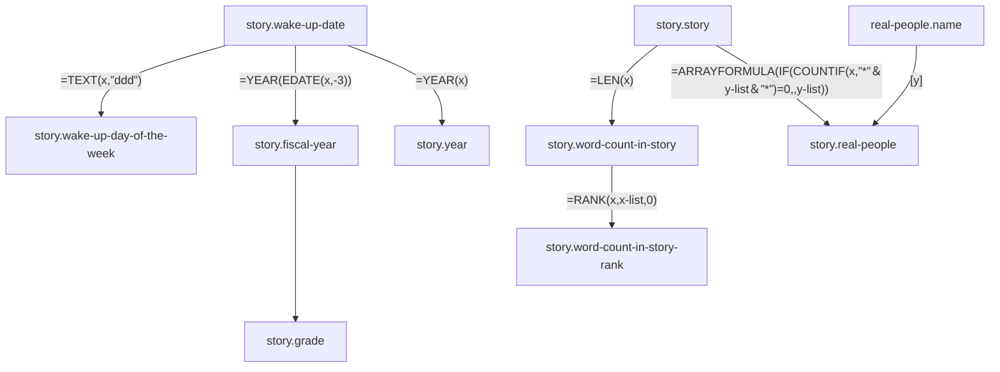
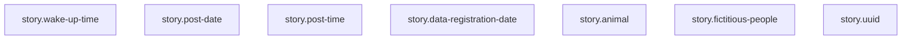
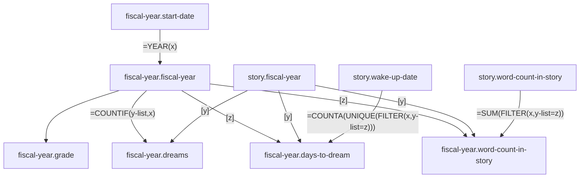
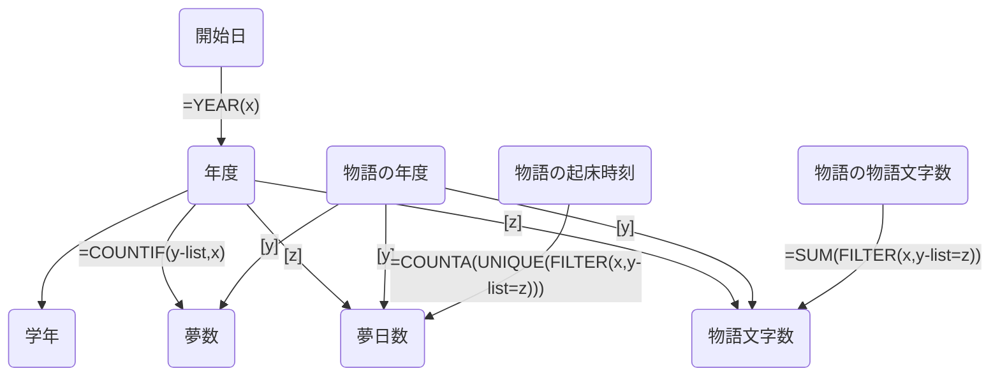
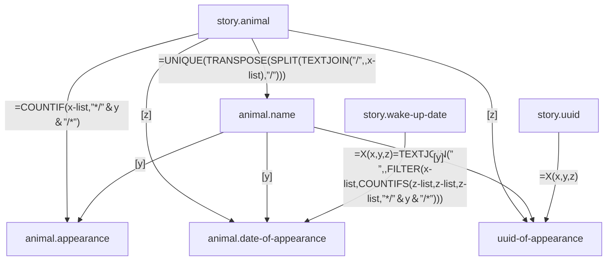

# 🔃 Flowchart

## 📝 story 物語

```mermaid
flowchart TD
  story.wake-up-date --"=TEXT(x,”ddd”)"--> story.wake-up-day-of-the-week
  story.wake-up-date --"=YEAR(EDATE(x,-3))"--> story.fiscal-year
  story.wake-up-date --"=YEAR(x)"--> story.year
  story.story --"=LEN(x)"--> story.word-count-in-story
  story.word-count-in-story --"=RANK(x,x-list,0)"--> story.word-count-in-story-rank
  story.story --"=ARRAYFORMULA(IF(COUNTIF(x,”*”＆y-list＆”*”)=0,,y-list))"--> story.real-people
  real-people.name --"[y]"--> story.real-people
  story.fiscal-year ---> story.grade
```

```mermaid
flowchart TD
  story.wake-up-time
  story.post-date
  story.post-time
  story.data-registration-date
  story.animal
  story.fictitious-people
  story.uuid
```

## 📅 fiscal-year 年度

```mermaid
flowchart TD
  fiscal-year.start-date --"=YEAR(x)"--> fiscal-year.fiscal-year --> fiscal-year.grade
  fiscal-year.fiscal-year --"=COUNTIF(y-list,x)"--> fiscal-year.dreams
  story.fiscal-year --"[y]"--> fiscal-year.dreams
  fiscal-year.fiscal-year --"[z]"--> fiscal-year.days-to-dream
  story.fiscal-year --"[y]"--> fiscal-year.days-to-dream
  story.wake-up-date --"=COUNTA(UNIQUE(FILTER(x,y-list=z)))"--> fiscal-year.days-to-dream
  fiscal-year.fiscal-year --"[z]"--> fiscal-year.word-count-in-story
  story.fiscal-year --"[y]"--> fiscal-year.word-count-in-story
  story.word-count-in-story --"=SUM(FILTER(x,y-list=z))"--> fiscal-year.word-count-in-story
```

```mermaid
flowchart TD
  fiscal-year.start-date(開始日) --"=YEAR(x)"--> fiscal-year.fiscal-year(年度) --> fiscal-year.grade(学年)
  fiscal-year.fiscal-year(年度) --"=COUNTIF(y-list,x)"--> fiscal-year.dreams(夢数)
  story.fiscal-year(物語の年度) --"[y]"--> fiscal-year.dreams(夢数)
  fiscal-year.fiscal-year(年度) --"[z]"--> fiscal-year.days-to-dream(夢日数)
  story.fiscal-year(物語の年度) --"[y]"--> fiscal-year.days-to-dream(夢日数)
  story.wake-up-date(物語の起床時刻) --"=COUNTA(UNIQUE(FILTER(x,y-list=z)))"--> fiscal-year.days-to-dream(夢日数)
  fiscal-year.fiscal-year(年度) --"[z]"--> fiscal-year.word-count-in-story(物語文字数)
  story.fiscal-year(物語の年度) --"[y]"--> fiscal-year.word-count-in-story(物語文字数)
  story.word-count-in-story(物語の物語文字数) --"=SUM(FILTER(x,y-list=z))"--> fiscal-year.word-count-in-story(物語文字数)
```

## 🐍 animal 生き物

```mermaid
flowchart TD
  story.animal --"=UNIQUE(TRANSPOSE(SPLIT(TEXTJOIN(”/”,,x-list),”/”)))"--> animal.name
  story.animal --"=COUNTIF(x-list,”*/”＆y＆”/*”)"--> animal.appearance
  animal.name --"[y]"--> animal.appearance
  story.animal --"[z]"--> animal.date-of-appearance
  animal.name --"[y]"--> animal.date-of-appearance
  story.wake-up-date --"=X(x,y,z)=TEXTJOIN(” ”,,FILTER(x-list,COUNTIFS(z-list,z-list,z-list,”*/”＆y＆”/*”)))"--> animal.date-of-appearance
  story.animal --"[z]"--> uuid-of-appearance
  animal.name --"[y]"--> uuid-of-appearance
  story.uuid --"=X(x,y,z)"--> uuid-of-appearance
```
