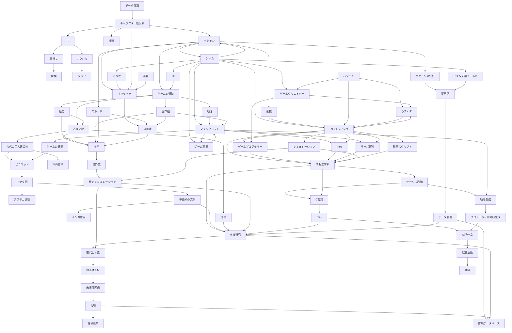

```mermaid
flowchart TD
  データ仮説-->キャラクター性仮説
  キャラクター性仮説-->虫
  キャラクター性仮説-->怪獣
  キャラクター性仮説-->ポケモン
  ポケモン-->ゲーム
  ゲーム-->ポケモン
  虫-->虫探し
  虫探し-->探検
  虫-->ナウシカ
  ナウシカ-->ジブリ
  ゲーム-->FF
  ゲーム-->マリオ
  ポケモン-->裏技
  ポケモン-->オリキャラ
  マリオ-->オリキャラ
  キャラクター性仮説-->オリキャラ
  漫画-->オリキャラ
  オリキャラ-->漫画家
  ゲーム-->ゲームクリエイター
  ゲーム-->プログラミング
  裏技-->プログラミング
  パソコン-->ゲームクリエイター
  パソコン-->プログラミング
  パソコン-->ウディタ
  ウディタ-->プログラミング
  プログラミング-->ウディタ
  ゲームクリエイター-->ウディタ
  プログラミング-->ゲームプログラマー
  ゲームクリエイター-->ゲームプログラマー
  ポケモン-->ゲームの遺跡
  ポケモン-->ストーリー
  ストーリー-->漫画家
  FF-->ゲームの遺跡
  ゲームの遺跡-->歴史
  ゲームの遺跡-->地理
  ゲームの遺跡-->世界観
  世界観-->漫画家
  ゲームの遺跡-->古代文明
  古代文明-->古代の巨大建造物
  古代の巨大建造物-->ピラミッド
  古代の巨大建造物-->大山古墳
  歴史-->古代文明
  古代文明-->マギ
  歴史-->マギ
  世界観-->マギ
  ストーリー-->マギ
  漫画家-->マギ
  マギ-->世界史
  ゲーム-->ゲーム実況
  ゲーム実況-->マインクラフト
  マインクラフト-->ゲーム実況
  ピラミッド-->マヤ文明
  マヤ文明-->アステカ文明
  マヤ文明-->中南米の文明
  中南米の文明-->インカ帝国
  ゲーム-->マインクラフト
  地理-->マインクラフト
  世界観-->マインクラフト
  マインクラフト-->ゲームの建築
  ゲームの建築-->ピラミッド
  マインクラフト-->mod
  マインクラフト-->サーバ運営
  プログラミング-->mod
  プログラミング-->サーバ運営
  プログラミング-->動画スクリプト
  世界史-->歴史シミュレーション
  プログラミング-->シミュレーション
  シミュレーション-->歴史シミュレーション
  プログラミング-->情報工学科
  ゲームプログラマー-->情報工学科
  mod-->情報工学科
  サーバ運営-->情報工学科
  動画スクリプト-->情報工学科
  シミュレーション-->情報工学科
  情報工学科-->卒業研究
  卒業研究-->古代日本史
  歴史シミュレーション-->古代日本史
  古代日本史-->魏志倭人伝
  魏志倭人伝-->宋書倭国伝
  宋書倭国伝-->古墳
  古墳-->古墳巡り
  中南米の文明-->卒業研究
  古代文明-->遺跡
  遺跡-->卒業研究
  歴史シミュレーション-->卒業研究
  ポケモン-->ポケモンの妄想
  ポケモンの妄想-->夢日記
  ゲーム-->リズム天国ゴールド
  リズム天国ゴールド-->夢日記
  情報工学科-->サークル活動
  サークル活動-->C言語
  情報工学科-->C言語
  C言語-->C++
  C++-->卒業研究
  サークル活動-->地形生成
  マインクラフト-->地形生成
  地形生成-->プロシージャル地形生成
  C++-->就活作品
  プロシージャル地形生成-->就活作品
  夢日記-->データ管理
  データ管理-->卒業研究
  データ管理-->古墳データベース
  古墳-->古墳データベース
  卒業研究-->古墳データベース
  就活作品-->就職活動
  就職活動-->就職
```
